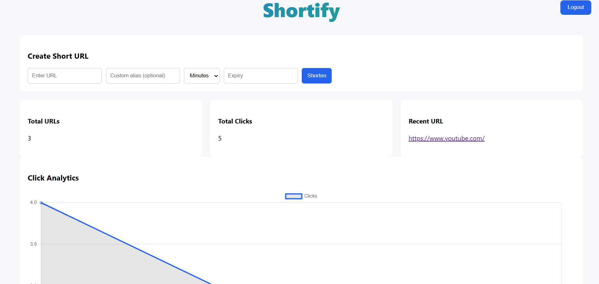
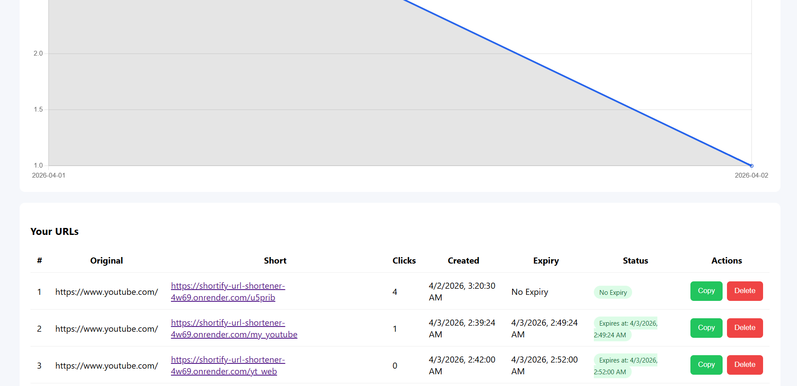
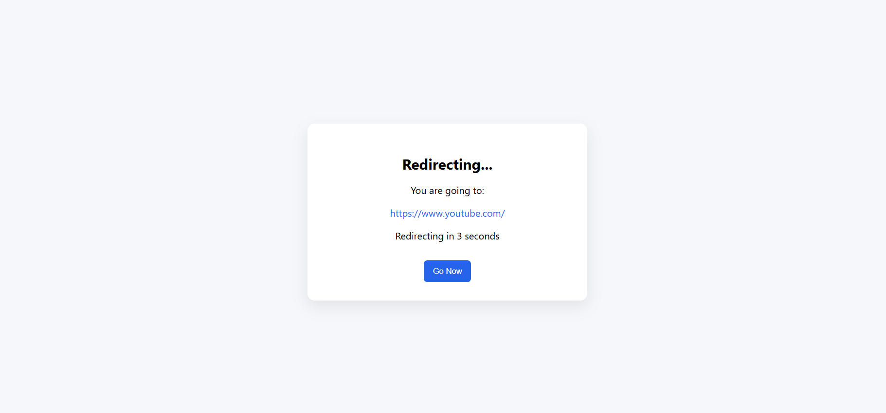

# 🚀 Shortify — Scalable URL Shortener with Analytics & User Management

## 🚀 Overview

Shortify is a full-stack URL shortening platform that enables users to create, manage, and analyze shortened links with features like authentication, custom aliases, expiration control, and real-time analytics.

The system is designed to demonstrate backend architecture, API design, and real-world production considerations such as data modeling, session management, and link lifecycle handling.

---

## 🌐 Live Demo

🔗 https://shortify-url-shortener-4w69.onrender.com

⚠️ *Note: Deployed on Render free tier — initial load may take a few seconds.*

---

## ✨ Key Features

### 🔐 Authentication & User Management

* Secure signup and login (session-based authentication)
* User-specific dashboard and data isolation

### ✂️ URL Shortening System

* Generate unique short URLs for long links
* Support for custom aliases (e.g., `/my-link`)
* Collision handling for unique link generation

### ⏳ Expiry & Lifecycle Management

* Set expiration (minutes/days)
* Automatic invalidation of expired links
* Status tracking (active/expired)

### 📊 Analytics Dashboard

* Track click counts per URL
* Visualize usage trends using Chart.js
* Monitor link activity over time

### 🧾 User Dashboard

* View all created links in one place
* See creation time, expiry, and status
* Manage links efficiently

### 📋 Link Management Tools

* Copy shortened links instantly
* Delete links
* Preview page before redirection

---

## ⚙️ System Architecture

User → Flask Backend → Service Layer → Database (SQLite)
                  ↓
            Analytics & Dashboard (Chart.js)

---

## 🧠 Design Decisions

* Used Flask Blueprints to modularize routing and improve maintainability
* Implemented a service layer to separate business logic from route handlers
* Designed unique short code generation with collision handling
* Managed session-based authentication for user isolation
* Handled link lifecycle (creation → usage → expiry → invalidation)

---

## ⚠️ Edge Cases Handled

* Duplicate custom alias prevention
* Expired links blocked from redirection
* Invalid or malformed URLs rejected
* Safe handling of deleted links

---

## 🔌 API Design (Conceptual)

* `POST /shorten` → Create short URL
* `GET /<short_code>` → Redirect to original URL
* `GET /dashboard` → Fetch user URLs & analytics

---
## 🎥 Demo Video

https://github.com/user-attachments/assets/cde645e3-0b47-4c6c-b72d-de08ecb34ba4

---

## 📸 Demo

### 🔹 URL Dashboard & Analytics




### 🔹 Redirect / Preview Page

---

## 🛠 Tech Stack

### Backend

* Python (Flask)
* Flask Blueprints (modular architecture)
* SQLAlchemy (ORM)

### Frontend

* HTML, CSS, JavaScript

### Database

* SQLite

### Visualization

* Chart.js

### Deployment

* Render

---

## 📁 Project Structure

```id="strct01"
Shortify/
│
├── app.py                # Main Flask application
├── config.py             # Configuration settings
├── models.py             # Database models
│
├── routes/
│   ├── url_routes.py     # URL handling APIs
│   └── auth_routes.py    # Authentication APIs
│
├── services/
│   └── url_service.py    # Business logic layer
│
├── templates/            # HTML templates
├── static/               # CSS & JavaScript
│
├── requirements.txt
├── Procfile
└── runtime.txt
```

---

## 🔄 How It Works

1. User signs up / logs in
2. Submits a long URL
3. Backend:

   * Generates unique short code or uses custom alias
   * Stores metadata (user, expiry, timestamps)
4. When link is accessed:

   * Validates expiry
   * Redirects to original URL
   * Updates click analytics
5. Dashboard displays aggregated insights

---

## 🚀 Scalability Considerations

* SQLite used for simplicity; can be replaced with PostgreSQL for production
* Redis caching can reduce redirect latency
* Stateless backend enables horizontal scaling
* Rate limiting required to prevent abuse

---

## ⚠️ Limitations

* SQLite not suitable for high-traffic production
* No caching or rate limiting implemented yet
* Free-tier deployment causes cold starts

---

## 🚀 Future Improvements

* PostgreSQL integration for scalable database
* Redis caching for performance optimization
* Rate limiting and abuse protection
* QR code generation for short links
* API documentation (Swagger/OpenAPI)

---

## 👨‍💻 Author

Developed as a full-stack system to demonstrate backend engineering, API design, and real-world application development.

---
